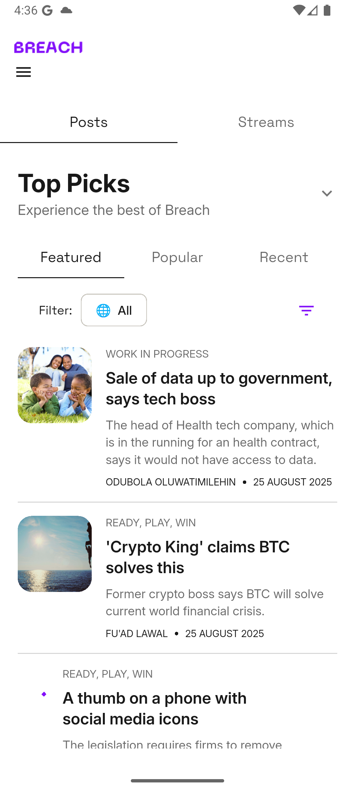

# 🏗️ Breach Interview Task

### ▶️ Android Demo Showcase

### ▶️ Ios Demo Showcase

### ▶️ Screenshots

> [!NOTE]
> Project runs on flutter version 3.32.5

### 📚 Description

The project is an implementation of the Breach wep app design into a mobile application. I have taken some creative liberties with the designs but done my best to stay true to the essesnce of the figma design.
It contains the following features:
- Explore Page: Available to the user without needing to authenticate.
- Log In page
- Sign Up Page
- Interests Page: Allows users pick their interests in regards to posts.
- Streams Page: Allows the user to view real time data of the recent posts on Breach's network via Websockets.

API integrations were done using dio network package and the websockets were handled via the web_socket_channel package.

The project is organized using a version of the clean architecture and a feature first file structure.
in the feature folder, folders are organized by their relevant actions
- Auth: This deals with the entry ui, the login and the sign up ui and functionality
- Splash: This is the splash page and governs initial entry navigation logic
- Home: This deals with the home page, the explore page and the stream page. 

The Projects is mainly subdivided into the following sections
- Core: For core services and variables that are utilized across the entire app. i.e constants, services, themes, etc
- Feature: As stated above is where the bulk on the code lies.
- Network: This handles all things relating to receiving and sending Api or WebSocket Requests
- Utils: For core helper classes and functions utilized across the app. I.e enums, extensions, formatters, validators, etc
- Widgets: This houses the generic reusable widgets that you can find in almost all the ui screens. i.e textfields, buttons, page_widgets, custom widgets, bottom sheets, etc

This project was built with the riverpod state management solution, for easy global  and consistent data handling as well as other features.

### ☄️ Running

You can run the project locally if you pull the repository and have flutter installed or you can
download any of the 2 apk files in the submission folder and install on your android device.

> [!NOTE]
> Please try the arm64-v8a apk first before trying the armeabi-v7a apk in case of compatibility
> issues.

### 🏷️ Project features

- Explore
- Authentication
- Interests
- Streams
- Posts & Filtering

### 🥸 Author

Agunbiade Ebunoluwa Enoch
- LinkedIn: [EnochTheSion](https://www.linkedin.com/in/ebunoluwa-agunbiade-233463167/)
